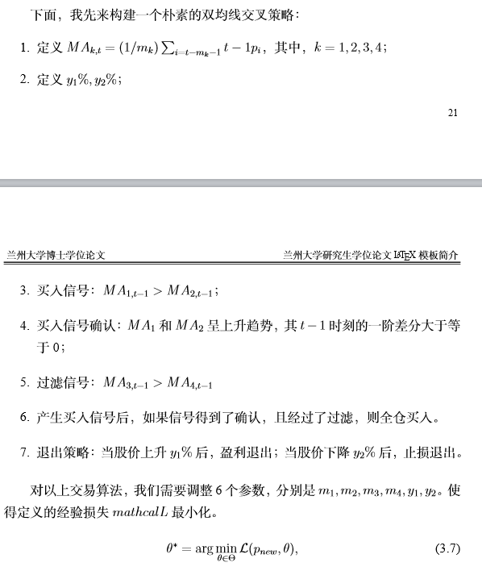
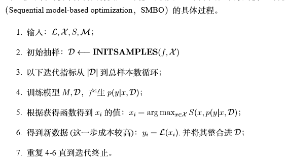
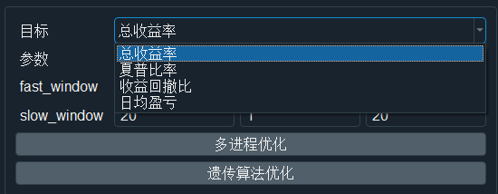
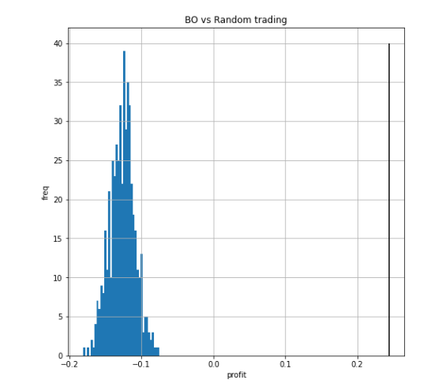
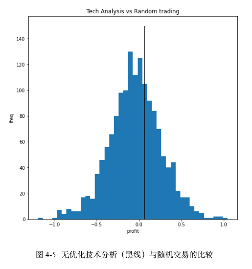
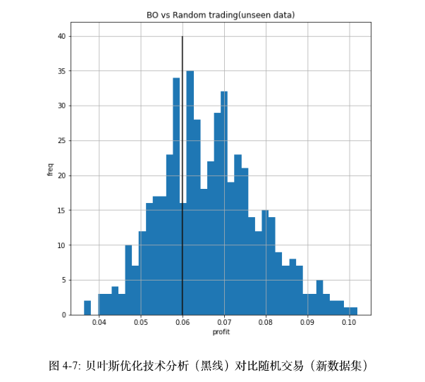

# 毕业论文方法简述

## 使用机器学习来理解技术分析

技术分析是指通过OHLC（开盘价、收盘价、最高价、最低价、成交量、持仓量）数据所计算出来的技术指标来产生交易信号，从而进行交易并盈利的手段。

对于技术分析研究方面，以往的文献停留在了部分参数及组合，量化投资的业界则将调参放在最后一步。这都不符合真实的老练技术分析交易员的操作方式。

本文用机器学习的思想看待技术分析，参考alphago的建模过程：
$$
i_{t-1}=f_\theta(I|\mathcal{F}_{t-1}),\\
a_t=\pi(i_{t-1}).
$$
上式花F表示t-1时刻所能得到的所有信息，在技术分析中，这可以代表当时及此前的所有OHLC数据。\theta表示信息挖掘的参数，例如双均线策略中，快线、慢线的周期等等。pi是决策系统，最终产生t时刻的交易行为：a_t.

那么, 上式中的\theta是不固定的可优化的. 在机器学习领域, theta常常被理解为hyper parameter, 通常通过验证集来调优. 而本文的技术分析数据挖掘系统中, theta类似于机器学习中的系数, 直接通过训练集(本文称为formation period)来训练, 训练的目标为求解:
$$
\arg\max_\theta \mathcal{L}(\theta)=\mathbf{Score}(a_t,a_{t-1},...,a_1),\\
where\ a_i=\mathbb{G}(\cdot|\theta,\mathcal{F}_{i-1}).
$$
a_i则是有技术分析信号产生的交易行为.

Score函数是交易指标, 指一个交易系统在一段时间内的表现. 可以是盈利率, 夏普比率, 索提诺比率, 胜率, 最大回撤率等. 或者是他们的加权平均. 对于Score的获得需要通过回测系统(backtest)来做. 以上则是基于机器学习的技术分析数据挖掘系统, 以下简称技术分析数据挖掘.

## 完整的双均线策略

本文所采用的技术分析交易系统是双均线策略, 这也是一个技术分析的入门策略. 但完整双均线策略并不常见与以往的文献中.本文构建的交易策略为(截图自之前的论文草稿):

## 运用贝叶斯优化对技术分析数据挖掘进行调参

在机器学习领域, 机器学习常常被用于hypter parameter的调参(tuning). 其目标函数常常是K-fold cross-validation的得分. 本文所提出的技术分析数据挖掘, 参数的意义更接近于机器学习领域中的系数.

但本文的score函数虽然基于已有数据, 是确定的, 但无法显式表达, 是不可导的, 因此无法使用基于梯度下降(gradient-based)的优化方法. 目前业界广泛采用暴力搜索, 随机搜索, 遗传算法, 类动物优化算法等方式进行优化. 但老练的技术分析交易员的思维过程实际上更接近于贝叶斯优化.

老练的交易员的调参过程:

- 设立参数初值
- 交易一段时间, 并产生一系列交易结果
- 根据交易结果来尝试下一步参数设置
- 重复以上步骤, 进一步积累交易数据, 并尝试可能的参数
- 从已经尝试过的参数中, 最终选择最优的参数

对比而言, 贝叶斯优化, 或称基于序列模型的优化(Sequential model based optimization, SMBO)的调参过程也有异曲同工之妙.

SMBO完全可以与老练的交易员的调参过程进行类比.

## 技术分析数据挖掘系统的规范化

此部分之前的文献草稿中未包含.

目前我正在使用的回测系统和参数调优系统, 是基于所有历史数据进行最后的参数调优. 使用的算法为暴力搜索(经过多进程优化)以及遗传算法. 优化目标有总收益率, 夏普比率, 收益回撤比, 日均盈亏.

根据之前的技术分析数据挖掘, 则可将技术分析交易系统的优化类比于机器学习系数优化. 因此, 可设立训练集和测试集. 在这个语境下, 可设立formation period和 test trading period. formation period用以计算对应的参数, test trading period用来测试训练结果和最后可能的盈利.

此外, 还可基于平稳性设计一种针对技术分析数据挖掘系统的滚动交叉验证(rotation cross-validation)流程, 用以更准确的计算系统盈利能力.

## 有效性检验

本文首先使用了Wald-Wolfowitz游程数检验. 再使用贝叶斯优化技术分析数据挖掘的方法, 来探讨市场有效性.

本文假设:

市场弱有效性等价于技术分析交易系统在**择时**方面的无效性.

进一步细化:

A股市场深圳交易所弱有效性等价于本文所采用的双均线交易系统在择时方面的无效.

根据之前设计的formation vs test trading流程, 先使用一定时长的数据进行技术分析数据挖掘, 并展现技术分析数据挖掘具备充分地学习能力, 再在test trading period上进行下一步操作.
$$
\mathcal{H_0}:
$$
贝叶斯优化技术分析数据挖掘在test trading period上与随机交易无差异.

因此, 可随机中 T 的时刻中抽取 t个时间, 作为持股时间. 计算出盈利率. 不断重复以上过程会产生一个经验分布, 根据Glivenko-Cantelli定理, 以概率1收率于潜在的分布.  最终可将技术分析数据挖掘交易系统的盈利结果与之比较.

下图为formation period, 贝叶斯优化技术分析交易系统与随机交易之间的比较, p值为0.

下图是无优化的传统技术分析与随机交易之间的比较:

可以看出, 使用无优化的技术分析信号, 无法检验市场有效性.

### unseen data与test trading period

根据之前设计的技术分析数据挖掘的formation vs test trading机制, 最终结果需要在test trading period在验证. 下图是结果, 很明显, 贝叶斯优化技术分析在择时方面与随机交易没有显著差异.

